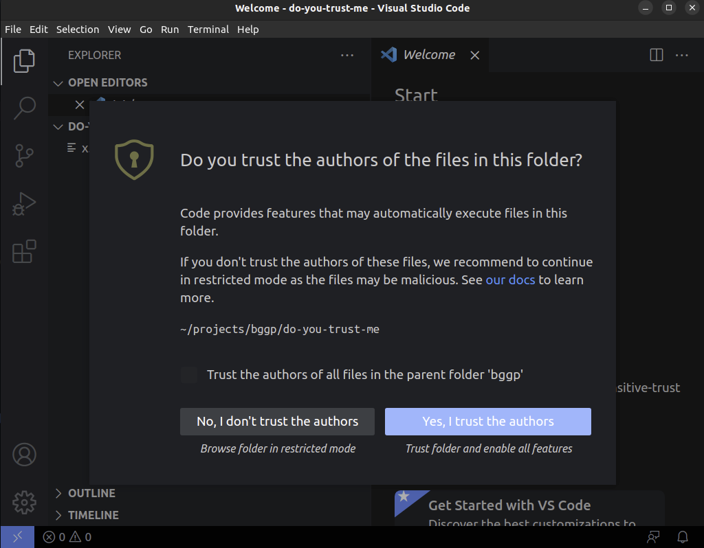

# lean-rw-dist

## Setup Instructions
1. Check that you have `git` installed on your computer correctly. The instructions are [here][Git install instructions]. You know you have git installed, if you can open your terminal and type `git --version` and you get a response like below:

2. If you are a windows user, I recommend installing an ubuntu distribution on top of WSL2. Lean can run on windows, but I am not good at fixing the installation issues on windows since I don't use it. The instructions are [here][WSL install instructions]

3. Install lean4. Follow the [instructions on this link][Lean install instructions]
4. open a terminal
5. `cd` to the folder inside which you want to maintain this repository.
6. Clone this repository by using `git clone https://github.com/Shreyas4991/lean-rw-dist.git`
7. `cd lean-rw-dist`
8. If you have installed lean correctly, then at this point, run `lake exe cache get`. This fetches pre-build Mathlib binaries.

9. Open your project in vscode by using the command `code .`. Vscode will ask you in a dialog box if you trust the authors of the files in this folder. Say "Yes".

I also recommend click on the checkbox about trusting the parent folder since the authors in question would be you.

10. Open the file `LeanRwDist/Basic.lean`
11. You should see something that looks like the below (ignoring the colours)

12. If you place your cursor at the end of line 3, you get a message that looks like the below on the right hand side 

[Lean install instructions]: https://lean-lang.org/install/
[WSL install instructions]: https://learn.microsoft.com/en-us/windows/wsl/install
[Git install instructions]: https://git-scm.com/install/